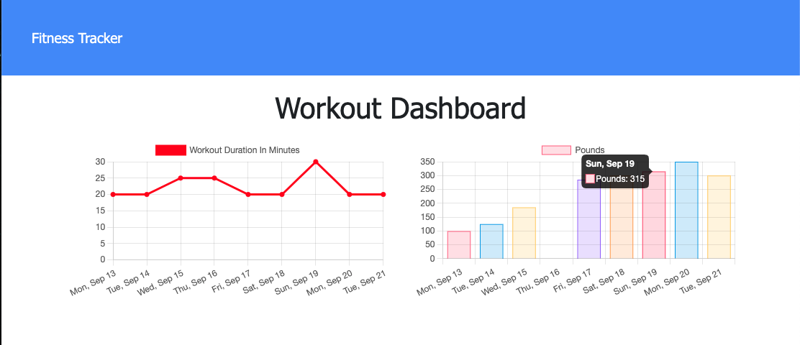

# Fitness-Tracker

LIVE URL:

REPOSITORY: https://github.com/Hayden-Haun/Fitness-Tracker

## Table of Contents

- [Description](#description)
- [Installation](#installation)
- [Contributions](#contributions)
- [Usage](#usage)
- [Tests](#tests)
- [Technologies Used](#Technologies)
- [Credits](#credits)
- [Questions](#questions)

## Description

    This app lets you track your fitness! Use the home page to add a new exercise to your current workout, or add another workout entirely. See the home page for total workout data, or click the Dashboard to see graphs of your progress from the last few sessions.

## Installation

    npm i

## Contributions

    Contact the owner

## Usage

    Launch Server: node server.js Seed Database: npm run seed

## Tests

    none

## Technologies Used

    MongoDB, Mongoose, Modular routing, Express.JS, Javascript, Node.JS, Heroku

## Credits

    Hayden Haun

## Questions

    For additional questions, please contact GitHub user Hayden-Haun at haydenhaun@gmail.com
